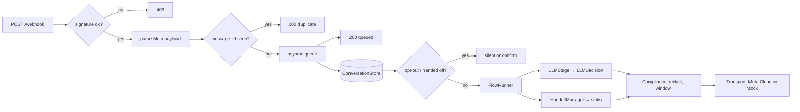

# whatsapp-agent-kit — stateful LLM agents for WhatsApp Business, built for South African SMEs

[](https://github.com/darrshangovender/whatsapp-agent-kit/actions/workflows/tests.yml)
[](LICENSE)
[](https://python.org)
[](https://developers.facebook.com/docs/whatsapp/cloud-api)

> Webhook verification and dedup, per-conversation state, declarative flows with an LLM stage, human handoff, quiet hours, opt-out keywords in English, Afrikaans and isiZulu, and POPIA-aware PII redaction — behind a `Transport` protocol so the whole thing runs and tests offline against a `MockTransport`.

**Why this exists.** South African SMEs run on WhatsApp, not web chat. Every WhatsApp bot project I have seen rebuilds the same plumbing and gets it subtly wrong: retried webhooks double-process an order, a free-form reply goes out 25 hours after the last inbound and Meta rejects it, "speak to someone" loops the bot, and the customer's ID number sits in a database with no retention policy. The bot logic is the easy part. This kit is the hard part, done once, with tests. It composes with [guardrail](https://github.com/darrshangovender/guardrail) (validate what goes into and out of the model) and [agent-tool-router](https://github.com/darrshangovender/agent-tool-router) (pick a tool, or refuse) — this repo owns the channel, those own the model boundary.

---

## Quick start

```bash
pip install -e ".[dev]"
python examples/booking_bot.py     # plumber's booking assistant, no keys, no network
```

```python
from wa_kit import Agent, ConversationStore, Flow, LLMStage, MockModel, MockTransport, Stage, min_length

store = ConversationStore("wa_kit.db")
flow = Flow("booking", [
    Stage("greet", prompt="Hi! Which suburb are you in?", slot="suburb",
          validator=min_length(3), next="problem"),
    LLMStage("problem", prompt="What's the problem?", slot="problem", next="done",
             model=MockModel(['{"intent":"repair","reply":"Noted.","slots_extracted":{},"needs_human":false}'])),
    Stage("done", prompt="Thanks, we'll be in touch.", terminal=True),
])
transport = MockTransport()
agent = Agent(store=store, transport=transport, flow=flow)
replies = await agent.handle(transport.inbound("27820000000", "hi"))  # sent, state persisted, history PII-redacted
```

In production `inbound` messages come from the webhook (`create_app` → queue → `agent.handle`); `MockTransport.inbound()` fabricates the same `InboundMessage` offline.

For the real thing, `examples/run_server.py` builds the same agent on `MetaCloudTransport` from `WA_*` env vars (see `.env.example`) and serves `/webhook` with Starlette.

## How it works



1. **Webhook** verifies `X-Hub-Signature-256` (HMAC-SHA256 of the raw body bytes, constant-time), parses text / image / document / location / interactive replies (reactions, stickers and anything else are typed `REACTION` / `UNSUPPORTED`, never dropped on the floor), ignores `statuses[]` callbacks, inserts the `message_id` into a SQLite dedup table, and enqueues. The 200 goes back before any bot logic runs.
2. **ConversationStore** holds `stage`, `slots`, `history`, `handoff`, `opted_out`, `consent_recorded` and `last_inbound_at` per `wa_id`; `can_send_freeform()` is the 24-hour service-window rule, computed from Meta's message timestamp (not receive time) and timezone-safe.
3. **FlowRunner** advances a declarative `Flow`: fill a slot, validate, move to `next` (a name or a function of the state). Two failed clarifications escalate.
4. **LLMStage** sends redacted history and redacted slots to a `ModelClient` and demands a strict `LLMDecision` (`intent`, `reply`, `slots_extracted`, `needs_human`). One self-correction retry on schema failure, then a deterministic fallback reply; a provider exception (timeout, outage) gets the same fallback rather than silence.
5. **HandoffManager** marks the conversation, notifies `LogSink` / `WebhookSink`, and silences the bot until `resume(wa_id)`.
6. **Compliance** redacts PII before anything is stored or sent to the model, honours opt-out keywords, enforces quiet hours and consent on marketing templates, and purges old conversations.

## What it handles for you

| Concern | Where | Behaviour |
|---|---|---|
| Webhook verification | `webhook.py` | GET challenge with `hub.verify_token`; POST rejected on bad/missing signature; malformed input is 4xx, never a 500 |
| Retried webhooks | `webhook.DedupStore` | `INSERT OR IGNORE` on `message_id`; duplicates acked, never re-processed |
| Reactions and statuses | `webhook.py`, `agent.py` | `statuses[]` are not messages; a 👍 reaction is parsed but is not a turn (no re-prompt, no escalation) |
| Ack latency | `webhook.create_app` | Enqueue and return; the handler runs in a background worker |
| 24-hour window | `conversation.py`, `templates.py` | `can_send_freeform()`; `TemplateSender` refuses free-form text outside it |
| Conversation state | `conversation.ConversationStore` | SQLite, one JSON document per `wa_id`, survives restarts |
| Flows | `flow.py` | `Stage` / `LLMStage`, validators, dynamic `next`, clarify-twice-then-escalate |
| Human handoff | `handoff.py` | Trigger words or `needs_human`; sinks notified; bot paused until `resume()` |
| Opt-out | `compliance.py` | `STOP`, `UNSUBSCRIBE`, `HOU OP`, `YEKA`, `OPT OUT`; case-, punctuation- and emoji-tolerant (`Stop…`, `opt-out`, `STOP 🛑`); checked before any model call; `START` opts back in; `TemplateSender` refuses every proactive send to an opted-out user |
| Quiet hours | `compliance.QuietHours` | Per-tenant timezone, crosses midnight; blocks marketing templates |
| PII (POPIA) | `compliance.PIIDetector` | SA ID (real calendar date + citizenship + Luhn), phone, email, bank account → placeholders; applied to stored history, LLM prompts and escalation payloads |
| Retention | `Compliance.purge_older_than(days)` | Deletes conversations by `last_seen` |
| Consent | `templates.TemplateSender` | Marketing templates require `consent_recorded` |
| Cloud API | `transport/meta_cloud.py` | Lazy `httpx` client, retry with backoff on 429/5xx, honours `Retry-After` |

## Design decisions

| Decision | Why |
|---|---|
| **`Transport` is a protocol, and `MockTransport` is first-class** | The suite and the example run with no Meta account. A bot you cannot run locally is a bot you cannot test. |
| **Ack first, process later** | Meta retries webhooks that do not return 200 quickly, and retries are the source of double-processing. The queue plus the dedup table make the handler idempotent. |
| **Redact before store, redact before model** | POPIA's minimality principle is easiest to satisfy if raw PII never lands anywhere. The history and the LLM prompt are built from the redacted text, not the original. |
| **Handoff pauses the bot, it does not end the conversation** | The state and slots survive; a human can `resume()` and the flow continues from where it was, or restarts. |
| **`LLMDecision` is `extra="forbid"`** | A model that invents fields is a model that will invent a `needs_human=false`. One retry with the validation error, then a fixed reply — never a half-parsed dict. |
| **Opt-out beats everything** | The keyword check runs before handoff and before the flow. An opted-out user gets one confirmation and then silence. |
| **Quiet hours gate proactive sends, not replies** | Answering a message the user just sent at 22:00 is fine; a marketing template at 22:00 is not. |
| **SQLite, one process** | An SME bot handles tens of conversations a day. Postgres and a broker are a later problem. |

## Limitations

- **No Meta template approval automation.** `Template.approved` is a flag you set; the kit does not call the Business Management API to check status or submit templates.
- **Single-process queue.** The asyncio queue lives in one worker. A restart mid-message loses whatever was queued (the dedup table will then reject Meta's retry of it). Swap in a broker if that matters.
- **No media transcription or download.** Images, documents and voice notes are parsed to a `Media` reference; nothing fetches or interprets the bytes.
- **The PII detector is pattern-based.** It catches well-formed SA ID numbers, SA phone numbers, emails and digit runs that look like bank accounts. It does not catch names, addresses, or an ID number with a space in the middle, and it will flag some innocent 8–12 digit numbers.
- **`MockModel` is the only model client shipped.** `ModelClient` is a two-method protocol; wiring a real provider is yours to do.
- **Quiet hours are per `Compliance` instance.** Multi-tenant deployments need one `Compliance` per tenant.

## Project layout

```
whatsapp-agent-kit/
├── wa_kit/
│   ├── agent.py            # orchestrator: compliance → handoff → flow → transport
│   ├── webhook.py          # Starlette app, payload parsing, DedupStore, worker
│   ├── conversation.py     # ConversationStore (SQLite) + 24h window
│   ├── flow.py             # Flow, Stage, LLMStage, LLMDecision, FlowRunner
│   ├── handoff.py          # HandoffManager, LogSink, WebhookSink
│   ├── compliance.py       # opt-out, QuietHours, PIIDetector, consent, purge
│   ├── templates.py        # TemplateRegistry, TemplateSender
│   ├── models.py           # ModelClient protocol, MockModel
│   └── transport/          # base protocol · meta_cloud (httpx) · mock
├── examples/               # booking_bot.py (offline) · run_server.py (Cloud API)
├── tests/                  # fully offline
├── Dockerfile · docker-compose.yml · .env.example
```

## Tests

```bash
make test        # offline; no keys, no network
make lint        # ruff
```

Covers webhook verification, signature rejection, replay dedup and ack timing; every inbound message type; window maths at 23h59 vs 24h01; slot filling, validator re-prompts, clarify-twice-then-escalate, LLM schema retry and fallback; handoff pause/resume and sink notification; every opt-out keyword; quiet hours across midnight; SA ID redaction on valid Luhn only; that stored history never contains raw PII; retention purge; template parameter validation and refusal outside the window.

## Author

Darrshan Govender · [Agulhas Code](https://agulhascode.co.za) · Durban, South Africa
